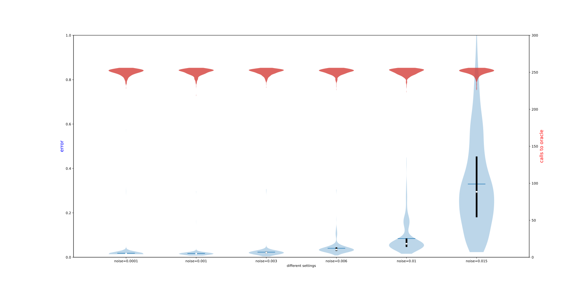
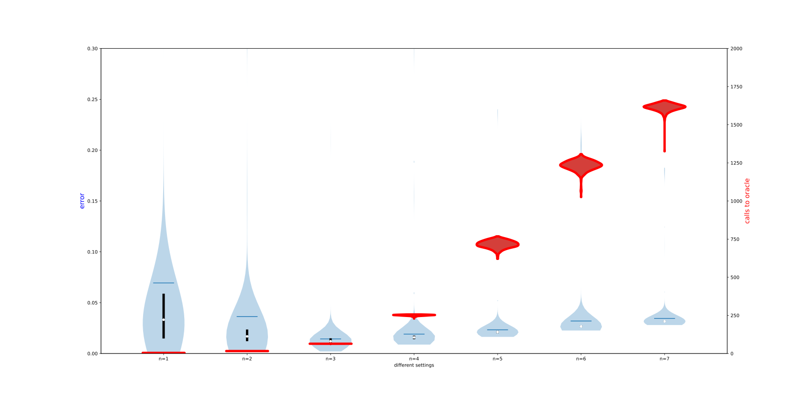
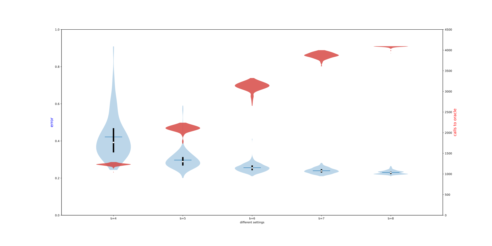

# Hamiltonian Learning, utils and demos

Repository for [Practical and Efficient Hamiltonian Learning](https://arxiv.org/abs/2201.00190).

## Overview

### Oracles

The oracle contained in *noisy_oracle.jl* mimics the actual evolution of the quantum system, by brutal-force state evolution under certain Hamiltonian. Specifically
- *oracle_f* extracts the second-order pauli error rates, as defined by equation (8) and (11)
- *oracle_s* gives the stage 2 measurements, defined by equation (15)

### Utils

*utils.jl* implements separately all the relevant procedures described in [the article](https://arxiv.org/abs/2201.00190), for instance, bins detection and peeling process (**Fig 1. (b)**) are wrapped in doPeel().

### hamLearning_xxx

These files glue and invoke all the subroutines together and demonstrate our algorithm under different settings (different Hamiltonian, different noise level, etc)

### data folder

The reconstruction results are stored in json format. Each json file contains
- a dictionary, representing the original Hamiltonian's parameters, i.e., the $s$ in main article
- a list of reconstructed parameters, containing
  - the reconstructed Hamiltonian
  - two numbers, counting the calls to the oracles in two subsequent stages.

### plot folder

Data analysis (with python) and results.

## Selected Results

- **Figure 3** in our article, demonstrating the supression of noise
    
    

- **Figure 4 (a)** in the article, random TFIM
    

- **Figure 4 (d)** in the article, estimated Hamiltonian for the $\text{H}_4$ (8 qubits) molecule
    
<!-- - random Ising, under various noise level:

    

- Ising, various noise level:

## Ising, scaling plot for different qubit number

random:

without randomness

## Random Ising, various b

## Chemical Ham

LiH4, top 25 largest terms

reconstruction with various b

## Random Ising n=4, increasing taylor expansion & fitting order $O(t^m)$

only even order is included, i.e. $m=6$ indicates fitting at order $t^0, t^2, t^4, t^6$

## other bar plots

Ising, n=6

## axis color changed

## box plot, demonstrating suppression of noise

## other chemical Hamiltonians

### Hchain, 4 atoms, 8 qubit, b=6, strengh * 10

top 60 terms

### Hchain, 3 atoms, 6 qubit, b=4, 5, 6, 7, strengh * 10

top 20 terms

### Hchain, 2 atoms, strengh * 10

full 14 terms

### revised figure, Hchain with 4 atoms

 -->
