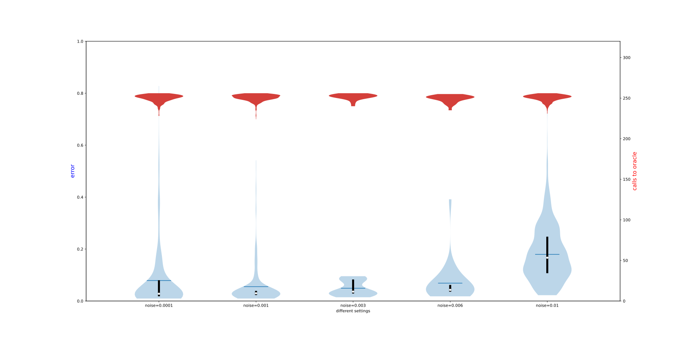

# Hamiltonian Learning, utils and demos

repository for [Practical and Efficient Hamiltonian Learning](https://arxiv.org/abs/2201.00190)

## noise

random Ising, various noise level:

Ising, various noise level:

## Ising, scaling plot for different qubit number

random:

without randomness

## Random Ising, various b

## Chemical Ham

LiH4, top 25 largest terms

reconstruction with various b

## Random Ising n=4, increasing taylor expansion & fitting order $O(t^m)$

only even order is included, i.e. $m=6$ indicates fitting at order $t^0, t^2, t^4, t^6$

## other bar plots

Ising, n=6

## axis color changed

## box plot, demonstrating suppression of noise

## other chemical Hamiltonians

### Hchain, 4 atoms, 8 qubit, b=6, strengh * 10

top 60 terms

### Hchain, 3 atoms, 6 qubit, b=4, 5, 6, 7, strengh * 10

top 20 terms

### Hchain, 2 atoms, strengh * 10

full 14 terms

### revised figure, Hchain with 4 atoms

