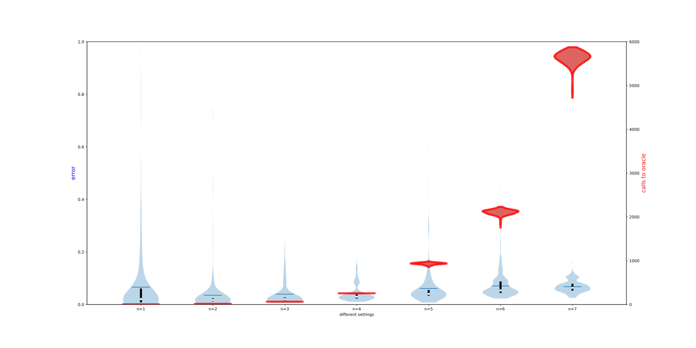

# Hamiltonian Learning, utils and demos

## noise

random Ising, various noise level:

Ising, various noise level:

## Ising, scaling plot for different qubit number

random:

without randomness

## Random Ising, various b

## Chemical Ham

LiH4, top 25 largest terms

reconstruction with various b

